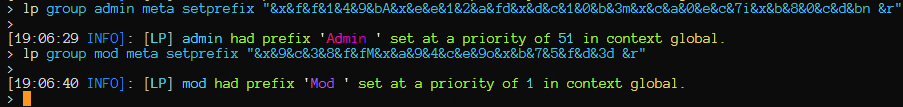

# DigitalOcean - PaperMC

 

A repository containing the configuration files for my Minecraft server.  


  - <details> <summary>List of topics</summary>

     - [Server Information](#server-information)
     - [Machine specifications](#machine-specifications)
     - [Overview](#overview)
     - [Plugins Used](#plugins-used)
     - [Configuration Overview](#configuration-overview)
     - [Detailed description](#detailed-description)
     - [Java 21 installation](#java-21-installation)
     - [Chat Formatting](#chat-prefixsuffix-formatting)
   </details>

## Server Information

*   **Minecraft Version:** 1.21.4
*   **Server Type:** PaperMC
*   **Hosting Provider:** DigitalOcean
*   **Hosting machine type:** Droplet

## Machine specifications

*   **CPU:** 4vCPU Premium AMD 3.00Ghz
*   **Memory:** 16GB
*   **Disk space:** 200GB NVMe
*   **Location:** Frankfurt Data Center - 1

## Overview

In here, you will be able to find configuration files for my Minecraft PaperMC 1.21.4 server hosted on DigitalOcean. This setup includes essential plugins for server management, world editing, permissions, player list display, and multi-world support.  

## Plugins Used

*   [EssentialsX](https://essentialsx.net/) - Essential commands and features for server administration and gameplay.
*   [WorldEdit](https://dev.bukkit.org/projects/worldedit) - In-game map editor for building and modification.
*   [LuckPerms](https://luckperms.net/) - A permissions management system.
*   [TAB](https://www.spigotmc.org/resources/tab-1-5-x-1-20-x.57806/) - Advanced player list and scoreboard customization.
*   [Multiverse-Core](https://dev.bukkit.org/projects/multiverse-core) - Multi-world management plugin.
*   [VentureChat] - For pretty prefix/suffix formatting.

## Configuration Overview

This repository includes configuration files for:

*   `server.properties`: Core server settings.
*   `bukkit.yml`, `spigot.yml`, `paper.yml`: Server performance and behavior tuning.
*   `plugins/Essentials/config.yml`: EssentialsX main configuration.
*   `plugins/LuckPerms/config.yml`: LuckPerms configuration.
*   `plugins/TAB/config.yml`: TAB configuration.
*   `plugins/Multiverse-Core/config.yml`: Multiverse-Core configuration.
*   `plugins/VentureChat/config.yml`: Main Chat plugin configuration.

## Detailed description

I run everything as a user `mc` on my server in the `/home/mc/mc-serv2` directory. 
I use Secure File Transfer Protocol with Termius to upload necessary `.jar` files to the server, since the `wget` command does not always work.

## Java 21 installation

Initially, I encountered an issue where `apt` would not install Java 21 — required by newer versions of PaperMC. It only had Java 17 available in the default Debian 12 repositories.

### Problem
```bash
root@debian-s-4vcpu-16gb-amd-fra1-01
▶ ~ # apt install openjdk-21-jdk-headless
E: Unable to locate package openjdk-21-jdk-headless

root@debian-s-4vcpu-16gb-amd-fra1-01
▶ ~ # apt install openjdk-21-jdk
E: Unable to locate package openjdk-21-jdk
```

### Solution: Installing Java 21 (Amazon Corretto) with SDKMAN!

I solved the issue by installing [SDKMAN!](https://sdkman.io/) and using it to install Java 21 (Amazon Corretto) **both for the root user and for the `mc` user who runs the Minecraft server**.

#### 1. Install SDKMAN:
```bash
curl -s "https://get.sdkman.io" | bash
source "$HOME/.sdkman/bin/sdkman-init.sh"
```

#### 2. Install Java 21 (Amazon Corretto):
```sh
root@debian-s-4vcpu-16gb-amd-fra1-01
▶ ~ # sdk list java
```

```
# ...output trimmed...
21.0.7-amzn
```
```bash
sdk install java 21.0.7-amzn
```
#### 3. Confirm installation:
```bash
java -version
# Output should be something like:
openjdk version "21.0.7" 2025-04-15 LTS
```

## Chat Prefix/Suffix Formatting

Initially, I used EssentialsX Chat for formatting but encountered limitations:
- **Hex colors in prefixes/suffixes were not respected**.
- **Placeholders like `%vault_prefix%` were not rendered in chat**.
- **Messages appeared as raw placeholders** (e.g. `%vault_prefix%%player_displayname%` or `<#21ff0e>- <#1ef327>W<#1be841>o ...` or `{vault_prefix}{player_displayname}`).
- Even after installing PlaceholderAPI and expansions, EssentialsX Chat did not handle them correctly.

###  What I Tried:
- Keeping EssentialsX Chat with PlaceholderAPI and LuckPerms expansions
- Double-checking `vault-compatibility.enabled` in LuckPerms
- Validating `vault_prefix` via `/papi parse <player> %vault_prefix%` (or `%vault_suffix%` )
- Reloading PAPI and LuckPerms
- Adjusting `meta-formatting` in LuckPerms config
- Testing various prefix formats (MiniMessage, legacy `&x&...` codes, etc.)

**All failed to make prefixes display correctly in EssentialsX Chat.**

###  Final Working Setup:
- Removed `EssentialsXChat.jar`
- Installed [VentureChat](https://www.spigotmc.org/resources/venturechat.771/)
- Installed [ProtocolLib](https://www.spigotmc.org/resources/protocollib.1997/) (required by VentureChat)
- Installed [PlaceholderAPI](https://www.spigotmc.org/resources/placeholderapi.6245/) and the following expansions:
```bash
/papi ecloud download Vault
/papi ecloud download LuckPerms
/papi ecloud download player
/papi reload
```
- Configured `LuckPerms/config.yml` to support prefix/suffix stacking
- Edited `plugins/VentureChat/config.yml`:
```yaml
format: "{vault_prefix}{player_displayname}{vault_suffix} &7➤ &f"
```

###  Common Issues Solved:
- **"%vault_prefix%" appearing as raw text**  caused by EssentialsX Chat, solved by switching to VentureChat
- **Weird angle brackets `<bold><underlined>` etc.**  caused by setting MiniMessage in suffix accidentally
- **Strange spacing between letters**  caused by adding space between every hex segment in `&x&1&2&3...`, fixed by removing spaces
- **"No one is listening to you"**  caused by no one being in VentureChat channel; harmless

###  Custom Prefixes Created:


```bash
lp group mod meta setprefix "&x&d&b&3&f&f&fM&x&c&0&3&f&f&fo&x&a&5&3&f&f&fd &r"

lp group admin meta setprefix "&x&f&f&1&4&9&bA&x&e&e&1&2&a&fd&x&d&c&1&0&b&3m&x&c&a&0&e&c&7i&x&b&8&0&c&d&bn &r"
```

###  Final Result:
Chat now correctly shows the gradient prefix/suffix from LuckPerms and all PAPI placeholders render properly using VentureChat.

