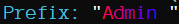
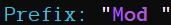
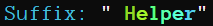

## Here you can find every single detail of the groups included in this server configuration

```md
> lp listgroups
[17:26:59 INFO]: [LP] Showing group entries:    (page 1 of 1 - 6 entries)
[17:26:59 INFO]: [LP] Groups: (name, weight, tracks)
[17:26:59 INFO]: [LP] -  admin - 0
[17:26:59 INFO]: [LP] -  default - 0
[17:26:59 INFO]: [LP] -  helper - 0
[17:26:59 INFO]: [LP] -  mod - 0
[17:26:59 INFO]: [LP] -  vip - 0
[17:26:59 INFO]: [LP] -  worldeditor - 0
```
#### Admin
```md
> lp group admin info
[17:27:58 INFO]: [LP] > Group Info: admin
[17:27:58 INFO]: [LP] - Display Name: admin
[17:27:58 INFO]: [LP] - Weight: None
[17:27:58 INFO]: [LP] - Parent Groups:
[17:27:58 INFO]: [LP]     > mod 
[17:27:58 INFO]: [LP] - Contextual Data: (mode: server)
[17:27:58 INFO]: [LP]     Prefix: "Admin "
[17:27:58 INFO]: [LP]     Suffix: None
[17:27:58 INFO]: [LP]     Meta: None
> lp group admin permission info
[17:28:51 INFO]: [LP] admin's Permissions:  (page 1 of 1 - 13 entries)
[17:28:51 INFO]: > essentials.* 
[17:28:51 INFO]: > luckperms.* 
[17:28:51 INFO]: > tab.* 
[17:28:51 INFO]: > worldedit.* 
[17:28:51 INFO]: > bukkit.command.gamemode 
[17:28:51 INFO]: > minecraft.comand.gamemode 
[17:28:51 INFO]: > minecraft.command.gamemode 
[17:28:51 INFO]: > minecraft.command.teleport 
[17:28:51 INFO]: > tab.admin 
[17:28:51 INFO]: > tab.reload 
[17:28:51 INFO]: > venturechat.staffchannel 
[17:28:51 INFO]: > venturechat.vipchat
```
#### Default
```md
> lp group default info
[17:29:45 INFO]: [LP] > Group Info: default
[17:29:45 INFO]: [LP] - Display Name: default
[17:29:45 INFO]: [LP] - Weight: None
[17:29:45 INFO]: [LP] - Contextual Data: (mode: server)
[17:29:45 INFO]: [LP]     Prefix: None
[17:29:45 INFO]: [LP]     Suffix: None
[17:29:45 INFO]: [LP]     Meta: None
> lp group default permission info
[17:30:07 INFO]: [LP] default's Permissions:  (page 1 of 1 - 19 entries)
[17:30:07 INFO]: > essentials.delhome 
[17:30:07 INFO]: > essentials.help 
[17:30:07 INFO]: > essentials.home 
[17:30:07 INFO]: > essentials.kit 
[17:30:07 INFO]: > essentials.list 
[17:30:07 INFO]: > essentials.motd 
[17:30:07 INFO]: > essentials.msg 
[17:30:07 INFO]: > essentials.reply 
[17:30:07 INFO]: > essentials.rules 
[17:30:07 INFO]: > essentials.sethome 
[17:30:07 INFO]: > essentials.spawn 
[17:30:07 INFO]: > essentials.tpa 
[17:30:07 INFO]: > essentials.tpaccept 
[17:30:07 INFO]: > essentials.tpadeny 
[17:30:07 INFO]: > essentials.tpdeny 
[17:30:07 INFO]: > essentials.warp 
[17:30:07 INFO]: > essentials.warp.list 
[17:30:07 INFO]: > tab.name.tag 
[17:30:07 INFO]: > tab.scoreboard.toggle
```
#### Helper
```md
> lp group helper info
[17:31:05 INFO]: [LP] > Group Info: helper
[17:31:05 INFO]: [LP] - Display Name: helper
[17:31:05 INFO]: [LP] - Weight: None
[17:31:05 INFO]: [LP] - Contextual Data: (mode: server)
[17:31:05 INFO]: [LP]     Prefix: None
[17:31:05 INFO]: [LP]     Suffix: " Helper"
[17:31:05 INFO]: [LP]     Meta: None
> lp group helper permission info
[17:33:47 INFO]: [LP] helper does not have any permissions set.
```
#### Mod
```md
> lp group mod info
[17:34:30 INFO]: [LP] > Group Info: mod
[17:34:30 INFO]: [LP] - Display Name: mod
[17:34:30 INFO]: [LP] - Weight: None
[17:34:30 INFO]: [LP] - Parent Groups:
[17:34:30 INFO]: [LP]     > default 
[17:34:30 INFO]: [LP] - Contextual Data: (mode: server)
[17:34:30 INFO]: [LP]     Prefix: "Mod "
[17:34:30 INFO]: [LP]     Suffix: None
[17:34:30 INFO]: [LP]     Meta: None
> lp group mod permission info
[17:35:11 INFO]: [LP] mod's Permissions:  (page 1 of 1 - 18 entries)
[17:35:11 INFO]: > essentials.chat.spy 
[17:35:11 INFO]: > essentials.invsee 
[17:35:11 INFO]: > essentials.jail 
[17:35:11 INFO]: > essentials.kick 
[17:35:11 INFO]: > essentials.mute 
[17:35:11 INFO]: > essentials.nick 
[17:35:11 INFO]: > essentials.nick.others 
[17:35:11 INFO]: > essentials.tempban 
[17:35:11 INFO]: > essentials.togglejail 
[17:35:11 INFO]: > essentials.tp 
[17:35:11 INFO]: > essentials.tpahere 
[17:35:11 INFO]: > essentials.tpaherer 
[17:35:11 INFO]: > essentials.tphere 
[17:35:11 INFO]: > essentials.unmute 
[17:35:11 INFO]: > essentials.vanish 
[17:35:11 INFO]: > essentials.vanish.see 
[17:35:11 INFO]: > tab.seevanished 
[17:35:11 INFO]: > tab.staff
```
#### Vip
```md
> lp group vip info
[17:35:36 INFO]: [LP] > Group Info: vip
[17:35:36 INFO]: [LP] - Display Name: vip
[17:35:36 INFO]: [LP] - Weight: None
[17:35:36 INFO]: [LP] - Contextual Data: (mode: server)
[17:35:36 INFO]: [LP]     Prefix: None
[17:35:36 INFO]: [LP]     Suffix: " - VIP -"
[17:35:36 INFO]: [LP]     Meta: None
> lp group vip permission info
[17:35:58 INFO]: [LP] vip's Permissions:  (page 1 of 1 - 1 entries)
[17:35:58 INFO]: > venturechat.vipchannel
```
#### Worldeditor
```md
> lp group worldeditor info
[17:36:26 INFO]: [LP] > Group Info: worldeditor
[17:36:26 INFO]: [LP] - Display Name: worldeditor
[17:36:26 INFO]: [LP] - Weight: None
[17:36:26 INFO]: [LP] - Parent Groups:
[17:36:26 INFO]: [LP]     > default 
[17:36:26 INFO]: [LP] - Contextual Data: (mode: server)
[17:36:26 INFO]: [LP]     Prefix: None
[17:36:26 INFO]: [LP]     Suffix: " WorldEdit "
[17:36:26 INFO]: [LP]     Meta: None
> lp group worldeditor permission info
[17:36:54 INFO]: [LP] worldeditor's Permissions:  (page 1 of 1 - 11 entries)
[17:36:54 INFO]: > worldedit.clipboard.* 
[17:36:54 INFO]: > worldedit.navigation.* 
[17:36:54 INFO]: > worldedit.region.* 
[17:36:54 INFO]: > worldedit.selection.* 
[17:36:54 INFO]: > worldedit.redo 
[17:36:54 INFO]: > worldedit.replace 
[17:36:54 INFO]: > worldedit.set 
[17:36:54 INFO]: > worldedit.stack 
[17:36:54 INFO]: > worldedit.undo 
[17:36:54 INFO]: > worldedit.wand
```


- Group Default is the main group for being the parent group. Mod and worldeditor have the group default set as the parent group, whereas Admin has Mod set as the parent group

```
> lp group admin parent set mod
[17:40:09 INFO]: [LP] admin had their existing parent groups cleared, and now only inherits mod in context global.

> lp group mod parent set default
[17:40:09 INFO]: [LP] mod had their existing parent groups cleared, and now only inherits default in context global.

> lp group worldeditor parent set default
[17:40:09 INFO]: [LP] worldeditor had their existing parent groups cleared, and now only inherits default in context global.
```

Since I can't add colors in markdown, below are screenshots of how the preffixes/suffixes look in game.
### Admin

### Mod

### Helper

### WorldEditor

### Vip

  
On the scoreboard from TAB plugin, those look practically identical. The only difference is the opacity of the background